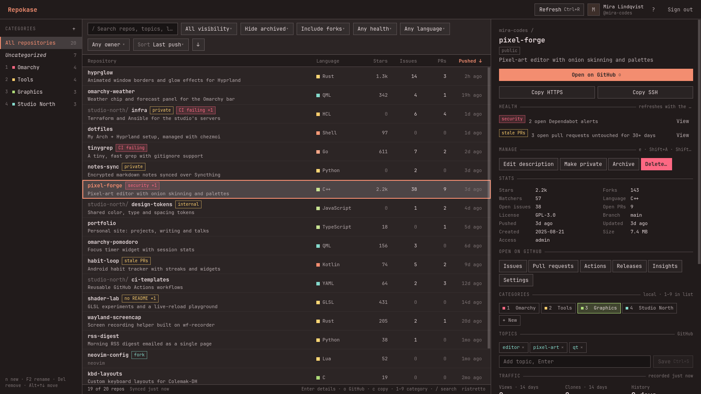
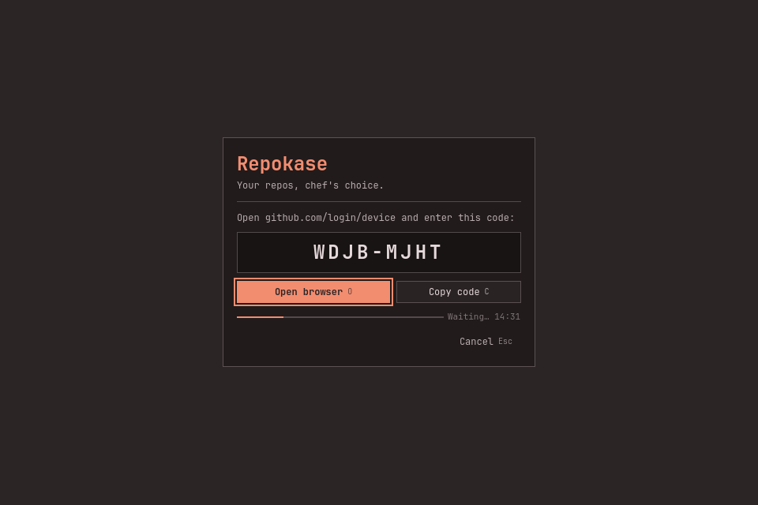
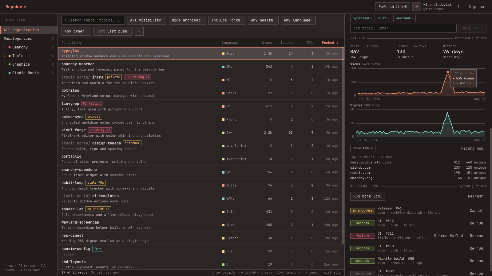
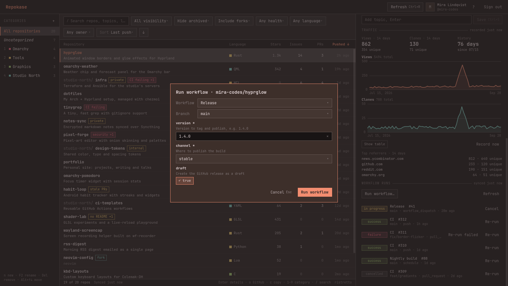
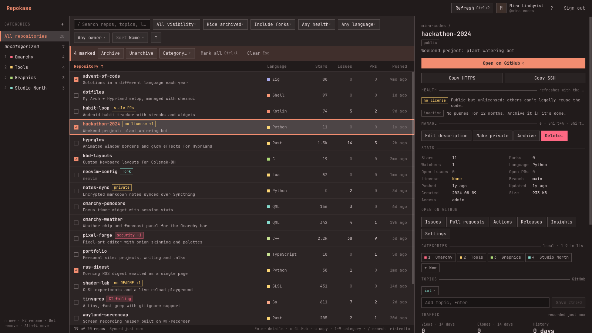
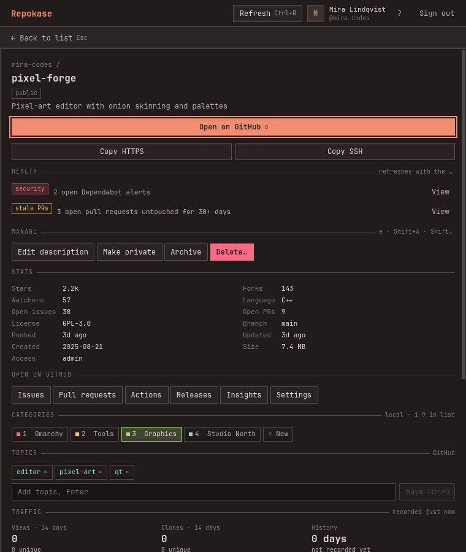
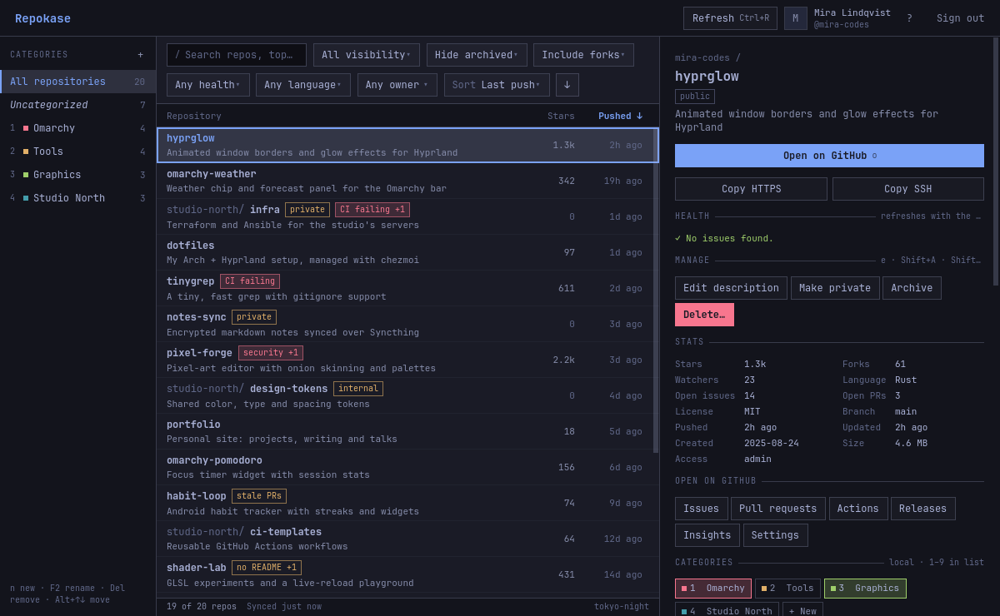
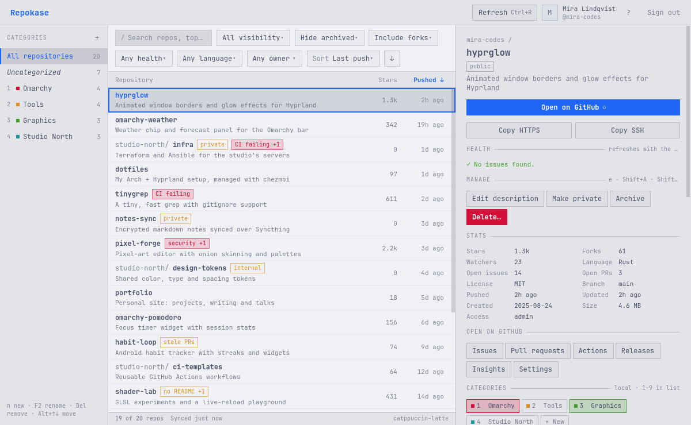

# Repokase

**Your repos, chef's choice.**



Repokase is a native desktop app for managing your GitHub repositories, built for
[Omarchy](https://omarchy.org). It shows every repository you own, collaborate on or
see through an organization, with their stats, CI status and topics, and lets you act
on them without opening the browser. It's fast and fully keyboard-driven, and it
follows your Omarchy theme and font live.

- Every repo in one list, with sorting, filtering and search. It opens instantly from a local cache and refreshes in the background.
- Details for each repo: stats, recent GitHub Actions runs, and quick links.
- Local categories (only on this computer) and GitHub topics.
- Archive and unarchive, change visibility, edit the description, delete (you type the name to confirm).
- Traffic history beyond GitHub's 14 days, with charts.
- GitHub Actions: re-run failed jobs, re-run or cancel runs, and start `workflow_dispatch` workflows with their input fields.
- Health at a glance: failing CI, Dependabot alerts, stale pull requests, a missing README or license, inactivity.
- Bulk actions: mark several repositories to archive or unarchive them, or add or remove a category.
- Repaints immediately when you run `omarchy theme set`. On other Arch systems it falls back to a built-in palette.

## Install

### From the AUR

```sh
yay -S repokase        # or: paru -S repokase
```

### From source

```sh
git clone https://github.com/ninepointlabs/repokase
cd repokase/packaging
makepkg -si
```

Runtime dependencies (all in the official repos): `pyside6`, `python-httpx`,
`python-qasync`, `python-secretstorage`, `python-yaml`. You also need a **Secret Service** provider to
store your sign-in: `gnome-keyring` (installed on Omarchy) or KWallet.

## First sign-in

1. Launch **Repokase** from the app launcher, or run `repokase`.
2. Press **Enter** (Sign in with GitHub). Repokase shows a short code.
3. Press **O** to open `github.com/login/device` (or **C** to copy the code), enter the
   code, and approve.
4. Repokase stores the token in your keyring and loads your repositories. The next start
   opens straight to your repos.

<p align="center"></p>

Repokase uses GitHub's
[OAuth device flow](https://docs.github.com/en/apps/oauth-apps/building-oauth-apps/authorizing-oauth-apps#device-flow).
It never sees your password and doesn't use a client secret. To sign out, click
**Sign out**, which removes the token from your keyring.

## Permissions and why

| Scope | Requested | Used for |
|---|---|---|
| `read:user` | at sign-in | Showing your account name and avatar. |
| `repo` | at sign-in | Listing public **and private** repositories and their issue/PR counts; editing descriptions and topics; changing visibility; archiving. GitHub has no narrower scope that covers private repositories. |
| `workflow` | at sign-in | Reading, re-running, cancelling and dispatching GitHub Actions workflows. |
| `delete_repo` | **only the first time you delete a repository** | Deleting repositories. Repokase explains the request first, and you approve it on GitHub. Every delete still requires typing the repository's full name. |

Where your data goes:

- **Your token is stored only in the Secret Service keyring**, never in a file or a log.
  If no keyring is available, Repokase says so and keeps the token in memory for that
  session only.
- **The cache** (repositories, workflow runs, your categories, UI settings) is a SQLite
  database at `~/.local/share/repokase/repokase.db`. Delete it at any time; Repokase
  rebuilds it on the next refresh.
- **Nothing is sent anywhere except `github.com` / `api.github.com`.**

### Organizations

- **Organizations with OAuth app access restrictions** only show their repositories
  after an organization owner approves Repokase
  ([GitHub docs](https://docs.github.com/en/organizations/managing-oauth-access-to-your-organizations-data/about-oauth-app-access-restrictions)).
- **Organizations that enforce SAML SSO** need you to authorize the token for that
  organization. Repokase shows a warning after refreshing, and an **Authorize SSO**
  button when an action needs it.

## Traffic history

GitHub only keeps **14 days** of views and clones. Repokase records them into its local
database once a day, so the charts in the details pane (views, clones, unique visitors,
top referrers) keep growing beyond GitHub's window. It records when the app starts if
the last snapshot is more than 20 hours old, and **Record now** does it on demand.
Traffic is only available for repositories you can push to.

To keep recording on days you don't open Repokase, enable the included systemd user
timer. It's off by default. It runs once a day, catches up after sleep or shutdown,
and uses the same keyring token and database as the app:

```sh
systemctl --user enable --now repokase-traffic.timer
systemctl --user list-timers repokase-traffic.timer   # next run
journalctl --user -u repokase-traffic.service         # what it recorded
```

You can also run it by hand: `repokase --snapshot-traffic`.



## GitHub Actions

The details pane lists the latest workflow runs. If you can push to the repository:

- **Failed** runs offer **Re-run failed** (only the failed jobs) and **Re-run**.
- **Finished** runs offer **Re-run**.
- **Queued or in-progress** runs offer **Cancel**.
- **Run workflow…** lists the workflows with a `workflow_dispatch` trigger, lets you
  pick a branch, and builds a form from the workflow's inputs (text, number, choice,
  boolean, environment). Required inputs are checked before anything is sent.



## Health

After each refresh, Repokase checks every repository in a few batched GraphQL
requests and shows the most serious issue as a badge in the list. The details pane
lists them all, each with a link to the matching GitHub page:

| Issue | Severity | Rule |
|---|---|---|
| security | critical | open Dependabot alerts |
| CI failing | serious | the latest commit on the default branch has failing checks |
| stale PRs | warning | open pull requests untouched for 30+ days |
| no README | warning | no README at the repository root |
| no license | warning | public repository without a license |
| inactive | info | no pushes for 6+ months (listed, but no badge) |

Archived repositories aren't checked. Filter with **Needs attention** or sort by
**Health**.

## Bulk actions

Mark repositories with `x` or Space, Shift+↓/↑ to extend, Ctrl+A for everything
visible, or Ctrl+click and Shift+click. A bar appears with **Archive**, **Unarchive**
and **Category…** (add or remove). Bulk archive confirms first, lists every repository
it will touch, skips the ones you can't change, and reports failures by name. Esc
clears the marks.



## Using it

Press **F1** (or `?`) in the app for the full list of shortcuts.

| Keys | Action |
|---|---|
| `/` `Ctrl+F` | Search (name, description, topics, language; every word must match) |
| `j` `k` / arrows | Move through the list |
| `Enter` / double-click | Details (full-width in narrow windows; `Esc` goes back) |
| `o` | Open on GitHub |
| `c` | Copy URL |
| `1`–`9` | Toggle the selected repo's category |
| `e`, `Shift+A`, `Shift+V`, `Delete` | Edit description, archive, visibility, delete |
| `x` / Space, `Shift+↓↑`, `Ctrl+A` | Mark for bulk actions (Esc clears) |
| `Ctrl+R` | Refresh from GitHub |
| `Ctrl+1` / `Ctrl+2` | Focus categories / list |
| `Ctrl+B` / `Ctrl+I` | Toggle the categories and details panes |

The layout adapts to the window width. At half-screen tile widths it shows the list and
opens details full-width. From 900px it shows the list and details side by side, and
from 1180px it adds the categories sidebar.

<p align="center"></p>

## Theming

Repokase reads the active Omarchy theme from `~/.local/state/omarchy/current/theme/`:

- `colors.toml` provides the palette (backgrounds, foregrounds, accent, selection,
  and the ANSI colors used for status and language dots).
- `shell.toml` provides the same hover, focus and selected-state alphas, spacing scale
  and base font size as the Omarchy shell, so Repokase matches the bar and menus.
- The UI font is your system monospace font (`omarchy font set`), and corner rounding
  follows Hyprland's `decoration:rounding`.

Repokase watches those files. When you switch theme or font it repaints immediately,
with no restart. Without an Omarchy theme it uses a built-in Tokyo Night palette.

<table>
  <tr>
    <td></td>
    <td></td>
  </tr>
  <tr>
    <td align="center">Tokyo Night</td>
    <td align="center">Catppuccin Latte</td>
  </tr>
</table>

### Hyprland

The Wayland app ID is `repokase`, so window rules can target `class:repokase`. For
example, to open it floating and centered on Omarchy, add this to
`~/.config/hypr/hyprland.lua` (Omarchy's `o.window` helper matches the class):

```lua
o.window("^repokase$", { float = true, center = true, size = { 1280, 800 } })
```

On other Hyprland setups, see the
[window rules documentation](https://wiki.hypr.land/Configuring/Basics/Window-Rules/)
for your version.

## Troubleshooting

- **"No Secret Service is available"**: install and start a keyring provider
  (`gnome-keyring`, or KWallet on KDE). Repokase won't store your token anywhere else.
- **Sign-in takes a few seconds after approving**: normal. GitHub makes apps wait about
  5 seconds between checks.
- **Some organization repos are missing**: see [Organizations](#organizations).
- **Verbose logs**: run `repokase --debug`. Tokens are never logged.

## Development

```sh
git clone https://github.com/ninepointlabs/repokase && cd repokase
# PySide6 comes from the system package; the venv only adds the rest.
/usr/bin/python -m venv --system-site-packages .venv
.venv/bin/pip install -e '.[test]'
.venv/bin/repokase --debug
QT_QPA_PLATFORM=offscreen .venv/bin/pytest
```

- Python + PySide6. Business logic lives in `src/repokase/` (API, auth, cache, theme,
  controllers); all UI is QML under `src/repokase/qml/`. Every UI component is a custom
  `Rk*` component that takes its colors, font and spacing from the `Theme` singleton;
  no stock Qt Quick Controls style is used.
- `tools/screenshots.py` regenerates the images in `docs/screenshots/` from invented
  demo data. It runs offline in offscreen Qt and never touches your keyring, cache or
  GitHub account.
- Useful environment variables:
  - `REPOKASE_THEME_DIR` points at any theme directory, for testing other themes.
  - `GITHUB_CLIENT_ID` uses your own GitHub OAuth App. It must have **Device Flow**
    enabled, and no client secret is needed.

## License

MIT. See [LICENSE](LICENSE).
